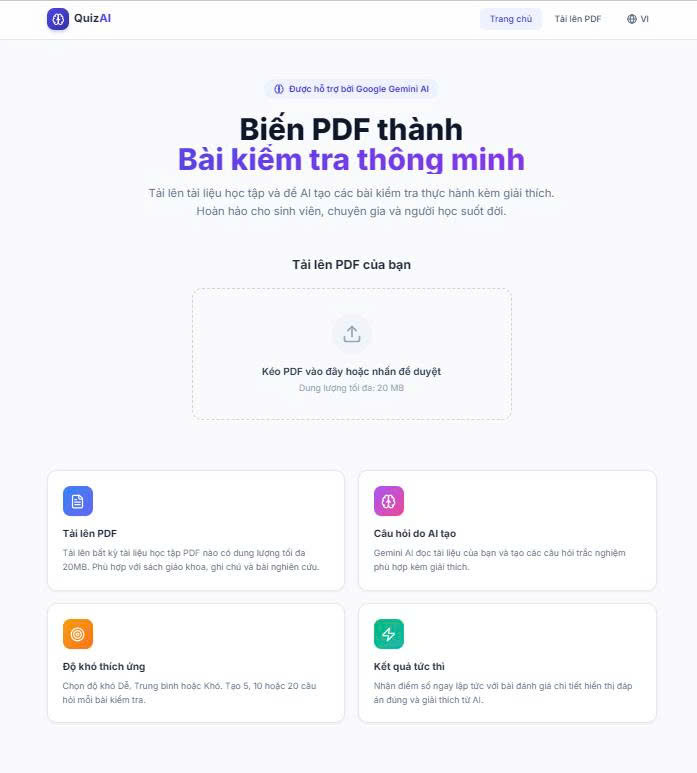
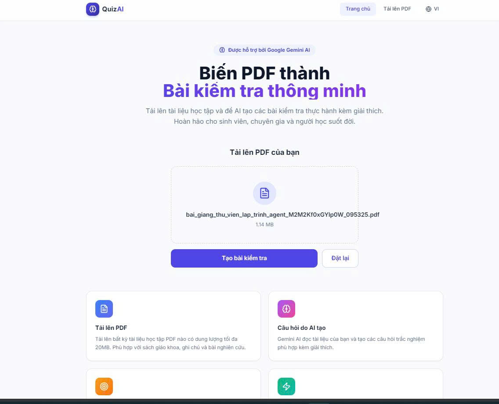
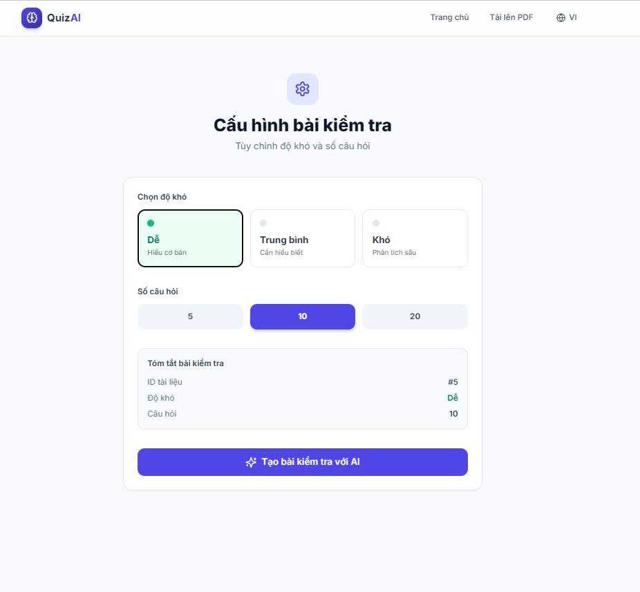
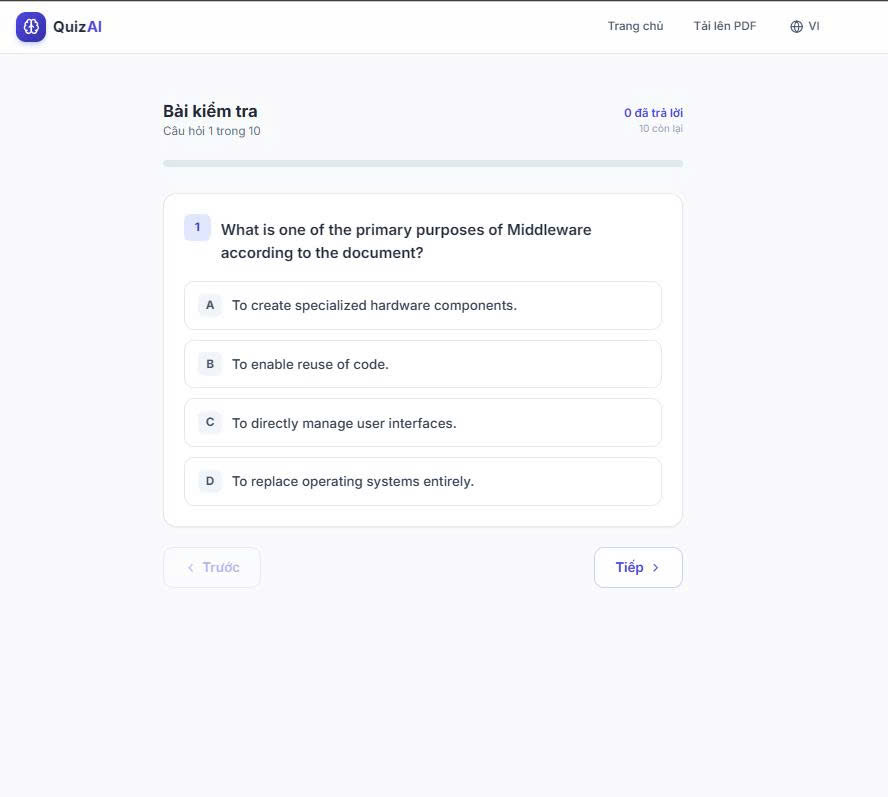
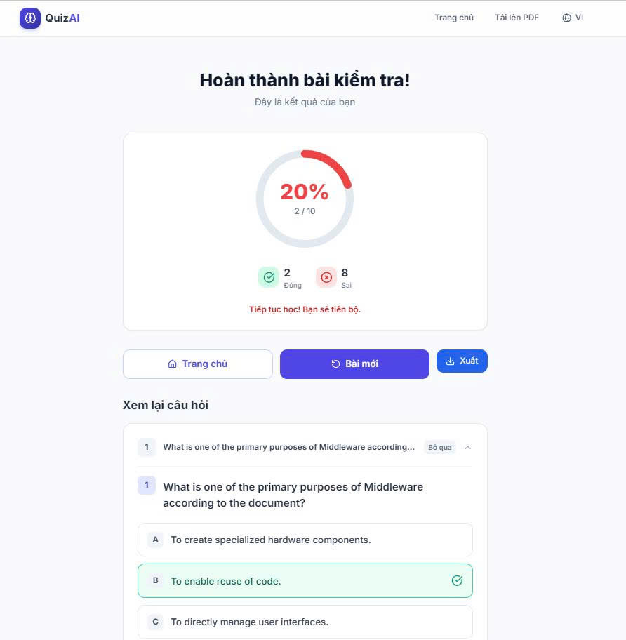
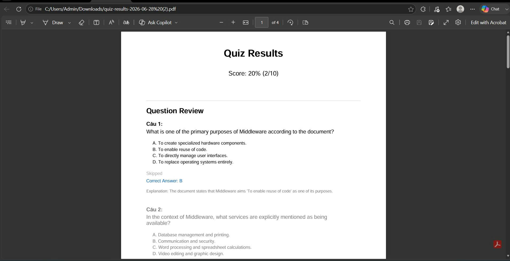

# AI Quiz Generator from PDF Documents

Upload any PDF learning material and generate AI-powered multiple-choice quizzes instantly using Google Gemini AI.

<div align="center">



</div>

## 🎯 Features

| Feature | Description |
|---------|-------------|
| **PDF Upload** | Drag-and-drop PDF files up to 20MB |
| **AI Quiz Generation** | Gemini AI reads your document and creates tailored questions |
| **Adaptive Difficulty** | Choose Easy, Medium, or Hard difficulty levels |
| **Flexible Question Count** | Generate 5, 10, or 20 questions per quiz |
| **Interactive Quiz** | One question per screen with progress tracking |
| **Instant Results** | Get your score immediately with percentage breakdown |
| **Detailed Review** | See correct answers alongside AI-generated explanations |
| **Export Quiz** | Export quiz results to PDF for offline review |
| **Responsive Design** | Works on desktop and mobile devices |

## 📸 Screenshots

### Home & Upload

| Upload PDF | Generate Quiz |
|------------|---------------|
|  |  |

### Quiz & Results

| Take Quiz | View Results |
|-----------|--------------|
|  |  |

### Export

| Export to PDF |
|---------------|
|  |

## 🛠️ Tech Stack

| Layer | Technology |
|-------|------------|
| Frontend | React 19, Vite, Tailwind CSS, React Router DOM, jsPDF, Nginx |
| Backend | Python Flask, SQLAlchemy, pdfplumber |
| AI | Google Gemini API |
| Database | SQLite |
| Container | Docker, Docker Compose |

## 🚀 Quick Start with Docker

### Prerequisites

- [Docker](https://docs.docker.com/get-docker/) installed and running
- Google Gemini API key

### 1. Get a Gemini API Key

Visit [Google AI Studio](https://aistudio.google.com/app/apikey) and create an API key.

### 2. Configure Environment

Create `backend/.env` file:

```
GEMINI_API_KEY=your-actual-gemini-api-key-here
```

### 3. Build and Run

```bash
docker-compose up --build
```

### 4. Open the App

Navigate to `http://localhost:3000`

## 📋 Usage Guide

1. **Upload PDF** - Drag and drop your PDF file on the home page
2. **Generate Quiz** - Select difficulty and number of questions
3. **Take Quiz** - Answer questions one by one
4. **View Results** - See your score and review answers
5. **Export PDF** - Download your quiz results

## 🐳 Docker Commands

| Command | Description |
|---------|-------------|
| `docker-compose up --build` | Build and start all services |
| `docker-compose up -d` | Start in detached mode |
| `docker-compose down` | Stop and remove containers |
| `docker-compose logs -f` | View live logs |
| `docker-compose ps` | Check container status |

## 🔌 API Endpoints

| Method | Endpoint | Description |
|--------|----------|-------------|
| POST | `/api/upload` | Upload PDF file |
| POST | `/api/generate` | Generate quiz questions |
| GET | `/api/questions/<id>` | Get questions |
| POST | `/api/submit` | Submit answers |
| GET | `/api/result/<id>` | Get detailed results |
| GET | `/api/health` | Health check |

## ❓ Troubleshooting

| Problem | Solution |
|---------|----------|
| **Docker build fails** | Ensure Docker is running. On Windows, make sure WSL2 is enabled. |
| **Gemini API errors** | Verify your `GEMINI_API_KEY` in `backend/.env` is correct and has available quota. |
| **PDF text extraction fails** | The PDF must contain selectable text (not scanned images). Scanned PDFs require OCR which is not supported. |
| **Frontend shows "Upload failed"** | Check that the backend container is healthy (`docker-compose ps`) and that port 5000 is not already in use. |
| **File too large** | The maximum upload size is 20MB. |
| **PDF export not working** | Ensure you're using the latest version. Check browser console for errors. |

## 📄 License

MIT License
